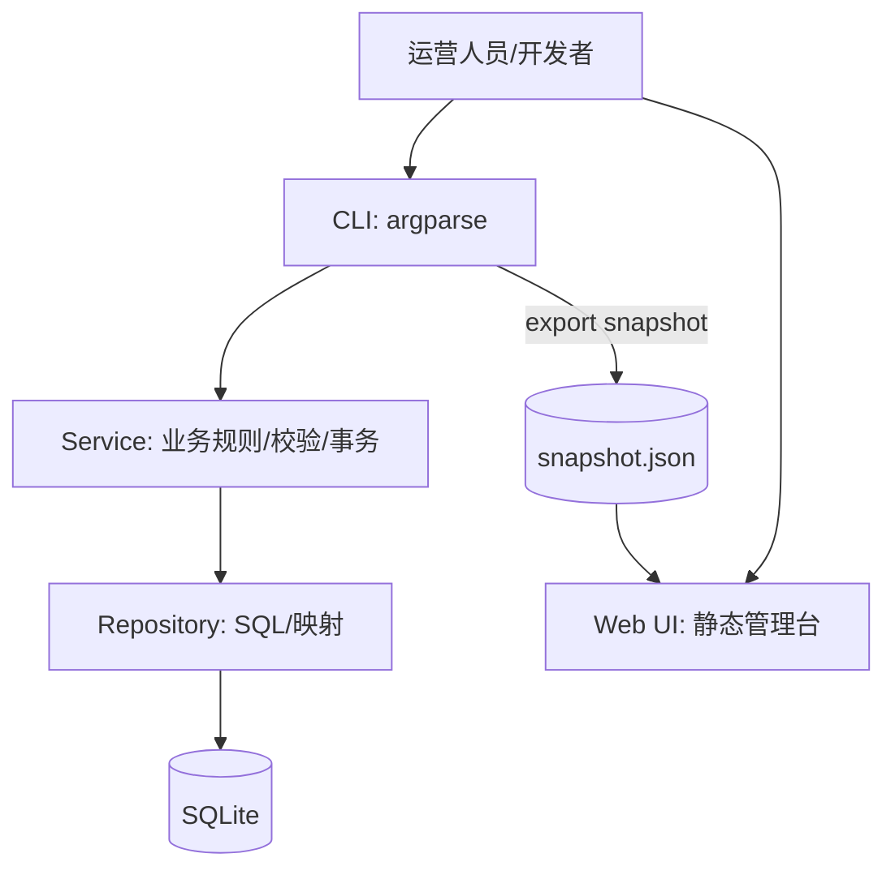

# 架构设计

## 总体架构

## 技术栈
- **后端:** Python 3.10+（标准库）
- **前端:** HTML / CSS / Vanilla JS（静态导入 JSON）
- **数据:** SQLite（WAL + foreign_keys + busy_timeout）

## 重大架构决策（ADR）

| adr_id | title | date | status | affected_modules | details |
|--------|-------|------|--------|------------------|---------|
| ADR-001 | 维持零运行时依赖并以快照导出对接 Web UI | 2025-12-31 | ✅已采纳 | CLI/Web/Service | helloagents/plan/202512312122_hotelmanager_quark_evolution/how.md#adr-001-维持零运行时依赖并以快照导出对接-web-ui |

